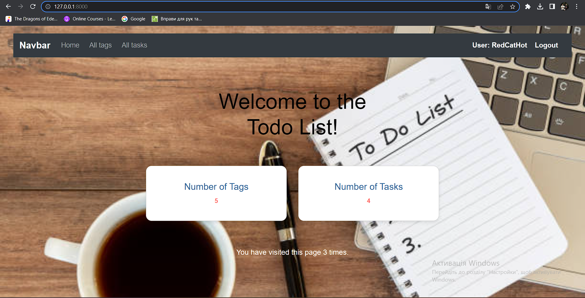
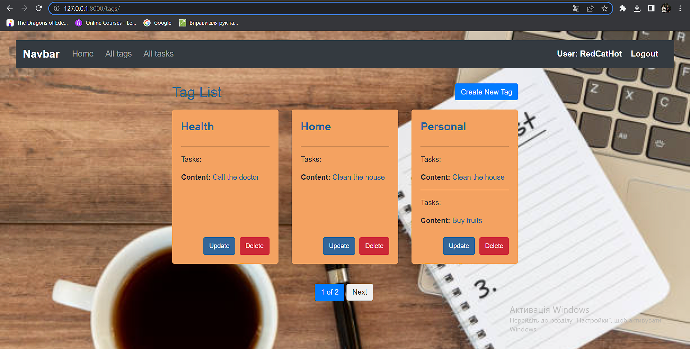
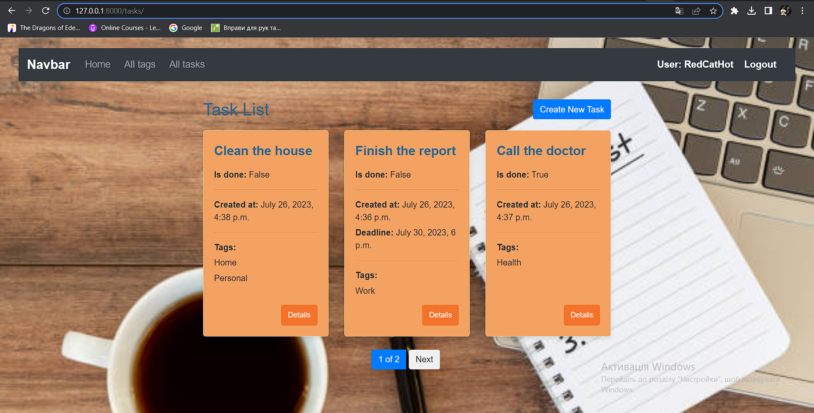

# To_Do_List

Django project for managing tasks and tags

## Installation

Python3 must be already installed

shell  
git clone https://github.com/RedCatHot/todo_list_exam/tree/develop 
cd todo_list  
python -m venv venv  
venv\Scripts\activate (on Windows)  
source venv/bin/activate (on macOS)  
pip install -r requirements.txt  
python manage.py runserver #starts Django Server

## Default user for website

username: RedCatHot  
password: Whatislove123

## Demo

Home page
  
  
Tags list page
  
  
Tasks list page

